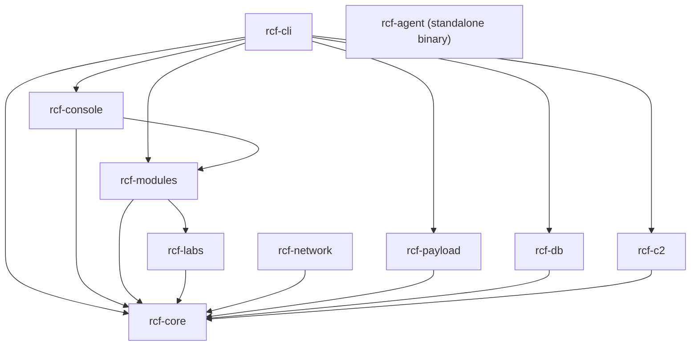

# RCF Architecture

## Crate Dependency Graph



| Crate | Role |
|---|---|
| `rcf-core` | Core traits (`Module`, `Context`, `Target`), error types, anonymity system |
| `rcf-cli` | Binary entry point — `clap` CLI, report generation, automation |
| `rcf-console` | Interactive REPL with tab completion and resource script support |
| `rcf-modules` | Module registry, dynamic lookup, `builtin.rs` registration |
| `rcf-labs` | 60+ exploit/scanner/post-exploitation module implementations |
| `rcf-network` | TCP scanners, protocol fingerprinting, raw socket support |
| `rcf-payload` | Shellcode templates, XOR encoder, polymorphic engine, output formats |
| `rcf-db` | SQLite + Diesel ORM — hosts, services, credentials (Argon2-hashed), vulns |
| `rcf-c2` | C2 server — session management, agent handler, control socket |
| `rcf-agent` | Standalone agent binary — connects back to C2, command allowlist enforced |

## Module Lifecycle

Every module implements the `Module` trait from `rcf-core`:

```
register → check → run → output
```

1. **register** — `ModuleRegistry::register(module)` stores the module by its `info().name` path (e.g. `"scanner/port/tcp_syn"`).
2. **check** — `module.check(&ctx)` validates that all required options are set in the `Context`. Returns `Err(RcfError::InvalidOption)` on the first missing required option.
3. **run** — `module.run(&mut ctx, &target)` executes the module asynchronously. Returns `Pin<Box<dyn Future<Output = Result<ModuleOutput>>>>`.
4. **output** — `ModuleOutput` carries `success`, `failure`, or `data` variants consumed by the CLI or console for display and DB storage.

## How to Add a New Exploit Module

**Step 1 — Implement the `Module` trait** in `rcf-labs/src/`:

```rust
use std::pin::Pin;
use std::future::Future;
use once_cell::sync::Lazy;
use rcf_core::{Context, Module, ModuleCategory, ModuleInfo, ModuleOptions, ModuleOption, Target};
use rcf_core::output::ModuleOutput;
use rcf_core::error::Result;

pub struct MyExploit;

static INFO: Lazy<ModuleInfo> = Lazy::new(|| ModuleInfo {
    name: "exploit/http/my_exploit".to_string(),
    display_name: "My Exploit".to_string(),
    description: "Does something useful".to_string(),
    authors: vec!["you".to_string()],
    category: ModuleCategory::Exploit,
    rank: 3,
    stability: "normal".to_string(),
    disclosure_date: Some("2024-01-01".to_string()),
    references: vec!["CVE-2024-XXXX".to_string()],
});

impl Module for MyExploit {
    fn info(&self) -> &ModuleInfo { &INFO }

    fn options(&self) -> ModuleOptions {
        let mut opts = ModuleOptions::new();
        opts.add(ModuleOption::new("RHOSTS", true, "Target host"));
        opts.add(ModuleOption::new("RPORT", true, "Target port"));
        opts  // ← must return opts
    }

    fn run(
        &self,
        ctx: &mut Context,
        target: &Target,
    ) -> Pin<Box<dyn Future<Output = Result<ModuleOutput>> + Send + '_>> {
        let addr = target.address();
        let info_name = self.info().name.clone();
        Box::pin(async move {
            // ... exploit logic ...
            Ok(ModuleOutput::success(&info_name, &addr, "exploited\n"))
        })
    }
}
```

**Step 2 — Export from `rcf-labs/src/lib.rs`:**

```rust
pub mod my_exploit;
pub use my_exploit::MyExploit;
```

**Step 3 — Register in `rcf-modules/src/builtin.rs`:**

```rust
registry.register(rcf_labs::MyExploit {});
```

That's it. The module is now discoverable via `rcf search`, `rcf info`, and `rcf run -m exploit/http/my_exploit`.

## C2 Protocol

The agent (`rcf-agent`) uses a simple line-based TCP protocol:

```
Agent → C2:  RCF_AGENT_V1:<psk>\n          (greeting + pre-shared key)
C2 → Agent:  RCF_AUTH_SUCCESS\n             (or AUTH_FAILED\n)
Agent → C2:  RCF_SYSINFO\n{json}\nRCF_SYSINFO_END\n
C2 → Agent:  <command>\n                    (any allowed command)
Agent → C2:  RCF_OUTPUT\n<b64_stdout>\n<b64_stderr>\n<exit_code>\nRCF_OUTPUT_END\n
C2 → Agent:  RCF_EXIT\n                     (disconnect)
```

The agent enforces a command allowlist (`ALLOWED_COMMANDS` in `rcf-agent/src/main.rs`) and a suspicious-pattern blocklist. Commands not on the allowlist are rejected before execution.

## Security Properties

| Property | Implementation |
|---|---|
| Credential storage | Argon2id hash + random salt; plaintext zeroed via `zeroize::Zeroizing` |
| DB file permissions | `0600` (owner read/write only) set on creation |
| C2 authentication | Pre-shared key required; agent refuses to start without one |
| Agent command sandbox | Allowlist + suspicious-pattern blocklist |
| TLS validation | `--strict-tls` flag; disabled by default for lab use |
| HTML reports | All user data HTML-escaped before insertion |
| Temp files | `tempfile` crate for unpredictable filenames |

## Error Handling

All crates use `rcf_core::error::RcfError` via the `?` operator. Key `From` conversions:

- `std::io::Error` → `RcfError::Io`
- `serde_json::Error` → `RcfError::Serialization`
- `toml::de::Error` / `toml::ser::Error` → `RcfError::Config`
- `anyhow::Error` → `RcfError::Generic`
- `reqwest::Error` → `RcfError::Network` (feature-gated)

## Anonymity System

`rcf-core/src/anonymity/` is split into focused sub-modules:

| Sub-module | Contents |
|---|---|
| `mod.rs` | `AnonymityLevel`, `AnonymityConfig`, TOML helpers |
| `proxy.rs` | `ProxyServer`, `ProxyProtocol`, `SshTunnelConfig` |
| `timing.rs` | `AnonymityManager` (jitter, UA rotation, WAF check), `random_source_port` |
| `waf.rs` | `WafDetection`, `detect_waf()`, `is_waf_blocked()` |
| `report.rs` | `ReportAnonymizer` (IP/username/email scrubbing) |
| `decoy.rs` | `DecoyConfig`, `DecoyTarget`, `DecoyMethod` |
